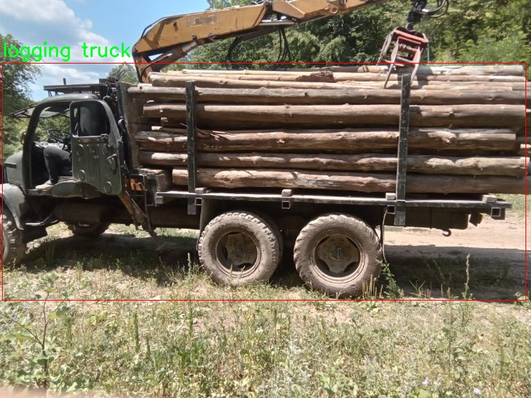

# 改进yolo11-SPPF-LSKA等200+全套创新点大全：木材运输车辆检测系统源码＆数据集全套

### 1.图片效果展示


##### 项目来源 **[人工智能促进会 2024.10.28](https://kdocs.cn/l/cszuIiCKVNis)**

注意：由于项目一直在更新迭代，上面“1.图片效果展示”和“2.视频效果展示”展示的系统图片或者视频可能为老版本，新版本在老版本的基础上升级如下：（实际效果以升级的新版本为准）

  （1）适配了YOLOV11的“目标检测”模型和“实例分割”模型，通过加载相应的权重（.pt）文件即可自适应加载模型。

  （2）支持“图片识别”、“视频识别”、“摄像头实时识别”三种识别模式。

  （3）支持“图片识别”、“视频识别”、“摄像头实时识别”三种识别结果保存导出，解决手动导出（容易卡顿出现爆内存）存在的问题，识别完自动保存结果并导出到tempDir中。

  （4）支持Web前端系统中的标题、背景图等自定义修改。

  另外本项目提供训练的数据集和训练教程,暂不提供权重文件（best.pt）,需要您按照教程进行训练后实现图片演示和Web前端界面演示的效果。

### 2.视频效果展示

[2.1 视频效果展示](https://www.bilibili.com/video/BV1Rt1jYZERy/)

### 3.背景

研究背景与意义

随着全球经济的快速发展，木材运输行业在资源开发与环境保护之间的平衡日益受到关注。木材作为一种重要的自然资源，其运输过程中的安全性和效率直接影响到生态环境和经济效益。因此，建立一个高效的木材运输车辆检测系统显得尤为重要。近年来，深度学习技术的迅猛发展为目标检测领域带来了新的机遇，尤其是YOLO（You Only Look Once）系列模型在实时物体检测中的应用，极大地提升了检测精度和速度。

本研究基于改进的YOLOv11模型，旨在开发一个针对木材运输车辆的检测系统。该系统将利用一个包含1800张图像的扩展木材运输车辆数据集，专注于对logging truck这一特定类别的检测。通过对数据集的深入分析与处理，我们期望提高模型在复杂环境下的识别能力，进而实现对木材运输车辆的精准监测。

此外，木材运输车辆的检测不仅可以提高运输过程的安全性，还能为运输管理提供数据支持，优化运输路线和调度，从而减少资源浪费和环境影响。通过对木材运输车辆的实时监控，相关部门能够及时发现和处理违规运输行为，进一步推动可持续发展目标的实现。

综上所述，基于改进YOLOv11的木材运输车辆检测系统的研究，不仅具有重要的学术价值，也对实际应用具有深远的意义。该系统的成功实施将为木材运输行业的智能化管理提供有力支持，促进资源的合理利用与环境的保护。

### 4.数据集信息展示

##### 4.1 本项目数据集详细数据（类别数＆类别名）

nc: 1
names: ['logging truck']


该项目为【目标检测】数据集，请在【训练教程和Web端加载模型教程（第三步）】这一步的时候按照【目标检测】部分的教程来训练

##### 4.2 本项目数据集信息介绍

本项目数据集信息介绍

本项目所使用的数据集名为“expanded-logging-trucks”，专门用于训练和改进YOLOv11模型，以实现高效的木材运输车辆检测系统。该数据集的设计旨在提供丰富的样本，以增强模型在实际应用中的准确性和鲁棒性。数据集中包含的类别数量为1，主要聚焦于“logging truck”这一特定类型的车辆。通过集中于单一类别，数据集能够提供更为详尽和精准的标注，确保模型在识别木材运输车辆时具备更高的灵敏度和准确性。

“expanded-logging-trucks”数据集不仅包含多样化的木材运输车辆图像，还涵盖了不同环境和条件下的拍摄场景。这些场景包括城市道路、乡村小道以及林区等多种背景，以模拟实际应用中可能遇到的各种情况。数据集中的图像经过精心挑选和标注，确保每一张图像都能为模型提供有效的学习信息。标注信息的准确性和一致性是数据集设计的核心考虑因素，这样可以最大限度地减少模型训练过程中的误差，提高最终检测系统的性能。

此外，数据集的扩展性也为后续研究提供了可能性。随着木材运输行业的发展和技术的进步，未来可以通过增加更多的样本和类别来进一步丰富数据集，从而提升模型的适应性和泛化能力。总之，“expanded-logging-trucks”数据集为本项目提供了坚实的基础，助力于构建一个高效、可靠的木材运输车辆检测系统，推动相关领域的研究与应用向前发展。





### 5.全套项目环境部署视频教程（零基础手把手教学）

[5.1 所需软件PyCharm和Anaconda安装教程（第一步）](https://www.bilibili.com/video/BV1BoC1YCEKi/?spm_id_from=333.999.0.0&vd_source=bc9aec86d164b67a7004b996143742dc)


[5.2 安装Python虚拟环境创建和依赖库安装视频教程（第二步）](https://www.bilibili.com/video/BV1ZoC1YCEBw?spm_id_from=333.788.videopod.sections&vd_source=bc9aec86d164b67a7004b996143742dc)

### 6.改进YOLOv11训练教程和Web_UI前端加载模型教程（零基础手把手教学）

[6.1 改进YOLOv11训练教程和Web_UI前端加载模型教程（第三步）](https://www.bilibili.com/video/BV1BoC1YCEhR?spm_id_from=333.788.videopod.sections&vd_source=bc9aec86d164b67a7004b996143742dc)


按照上面的训练视频教程链接加载项目提供的数据集，运行train.py即可开始训练



     Epoch   gpu_mem       box       obj       cls    labels  img_size
     1/200     20.8G   0.01576   0.01955  0.007536        22      1280: 100%|██████████| 849/849 [14:42<00:00,  1.04s/it]
               Class     Images     Labels          P          R     mAP@.5 mAP@.5:.95: 100%|██████████| 213/213 [01:14<00:00,  2.87it/s]
                 all       3395      17314      0.994      0.957      0.0957      0.0843

     Epoch   gpu_mem       box       obj       cls    labels  img_size
     2/200     20.8G   0.01578   0.01923  0.007006        22      1280: 100%|██████████| 849/849 [14:44<00:00,  1.04s/it]
               Class     Images     Labels          P          R     mAP@.5 mAP@.5:.95: 100%|██████████| 213/213 [01:12<00:00,  2.95it/s]
                 all       3395      17314      0.996      0.956      0.0957      0.0845

     Epoch   gpu_mem       box       obj       cls    labels  img_size
     3/200     20.8G   0.01561    0.0191  0.006895        27      1280: 100%|██████████| 849/849 [10:56<00:00,  1.29it/s]
               Class     Images     Labels          P          R     mAP@.5 mAP@.5:.95: 100%|███████   | 187/213 [00:52<00:00,  4.04it/s]
                 all       3395      17314      0.996      0.957      0.0957      0.0845


###### [项目数据集下载链接](https://kdocs.cn/l/cszuIiCKVNis)

### 7.原始YOLOv11算法讲解

YOLO11采用改进的骨干和颈部架构，增强了特征提取能力，提高了物体检测的精确度和复杂任务的表现。YOLO11引入精炼的架构设计和优化的训练流程，实现更快的处理速度，同时保持精度和性能之间的最佳平衡。通过模型设计的进步，YOLO11m在COCO数据集上实现了更高的均值平均精度（mAP），同时使用比YOLOv8m少22%的参数，使其在不妥协准确性的情况下更加计算高效。YOLO11可以无缝部署在各种环境中，包括边缘设备、云平台以及支持NVIDIA
GPU的系统，确保最大灵活性。无论是物体检测、实例分割、图像分类、姿态估计，还是定向物体检测（OBB），YOLO11都旨在应对多样的计算机视觉挑战。


##### **Ultralytics YOLO11相比于之前版本的主要改进有哪些？**

Ultralytics YOLO11在其前身基础上引入了几项重要进步。主要改进包括：

  1. **增强的特征提取** ：YOLO11采用改进的骨干和颈部架构，增强了特征提取能力，提高了物体检测的精确度。
  2.  **优化的效率和速度** ：精炼的架构设计和优化的训练流程实现了更快的处理速度，同时保持了准确性和性能之间的平衡。
  3.  **更高的准确性与更少的参数** ：YOLO11m在COCO数据集上实现了更高的均值平均精度（mAP），同时使用比YOLOv8m少22%的参数，使其在不妥协准确性的情况下更加计算高效。
  4.  **环境适应性强** ：YOLO11可以在多种环境中部署，包括边缘设备、云平台以及支持NVIDIA GPU的系统。
  5.  **支持广泛的任务** ：YOLO11支持多种计算机视觉任务，如物体检测、实例分割、图像分类、姿态估计和定向物体检测（OBB）。

我们先来看一下其网络结构有什么变化，可以看出，相比较于YOLOv8模型，其将CF2模块改成C3K2，同时在SPPF模块后面添加了一个C2PSA模块，且将YOLOv10的head思想引入到YOLO11的head中，使用深度可分离的方法，减少冗余计算，提高效率。下面我们来详细看一下这两个模块的结构是怎么构成的，以及它们为什么要这样设计


##### C3K2的网络结构

从下面图中我们可以看到，C3K2模块其实就是C2F模块转变出来的，它代码中有一个设置，就是当c3k这个参数为FALSE的时候，C3K2模块就是C2F模块，也就是说它的Bottleneck是普通的Bottleneck；反之当它为true的时候，将Bottleneck模块替换成C3模块。


##### C2PSA的网络结构

` `C2PSA是对 `C2f` 模块的扩展，它结合了PSA(Pointwise Spatial
Attention)块，用于增强特征提取和注意力机制。通过在标准 `C2f` 模块中引入 PSA
块，C2PSA实现了更强大的注意力机制，从而提高了模型对重要特征的捕捉能力。


##### **C2f 模块回顾：**

**** C2f模块是一个更快的 CSP（Cross Stage Partial）瓶颈实现，它通过两个卷积层和多个 Bottleneck
块进行特征提取。相比传统的 CSPNet，C2f 优化了瓶颈层的结构，使得计算速度更快。在 C2f中，`cv1` 是第一个 1x1
卷积，用于减少通道数；`cv2` 是另一个 1x1 卷积，用于恢复输出通道数。而 `n` 是一个包含 Bottleneck 块的数量，用于提取特征。

##### **C2PSA 模块的增强** ：

**C2PSA** 扩展了 C2f，通过引入PSA( **Position-Sensitive Attention)**
，旨在通过多头注意力机制和前馈神经网络来增强特征提取能力。它可以选择性地添加残差结构（shortcut）以优化梯度传播和网络训练效果。同时，使用FFN
可以将输入特征映射到更高维的空间，捕获输入特征的复杂非线性关系，允许模型学习更丰富的特征表示。

##### head部分

YOLO11在head部分的cls分支上使用深度可分离卷积 ，具体代码如下，cv2边界框回归分支，cv3分类分支。

    
    
     self.cv2 = nn.ModuleList(
                nn.Sequential(Conv(x, c2, 3), Conv(c2, c2, 3), nn.Conv2d(c2, 4 * self.reg_max, 1)) for x in ch
            )
            self.cv3 = nn.ModuleList(
                nn.Sequential(
                    nn.Sequential(DWConv(x, x, 3), Conv(x, c3, 1)),
                    nn.Sequential(DWConv(c3, c3, 3), Conv(c3, c3, 1)),
                    nn.Conv2d(c3, self.nc, 1),
                )
                for x in ch
            )


### 8.200+种全套改进YOLOV11创新点原理讲解

#### 8.1 200+种全套改进YOLOV11创新点原理讲解大全

由于篇幅限制，每个创新点的具体原理讲解就不全部展开，具体见下列网址中的改进模块对应项目的技术原理博客网址【Blog】（创新点均为模块化搭建，原理适配YOLOv5~YOLOv11等各种版本）

[改进模块技术原理博客【Blog】网址链接](https://gitee.com/qunmasj/good)


#### 8.2 精选部分改进YOLOV11创新点原理讲解

###### 这里节选部分改进创新点展开原理讲解(完整的改进原理见上图和[改进模块技术原理博客链接](https://gitee.com/qunmasj/good)【如果此小节的图加载失败可以通过CSDN或者Github搜索该博客的标题访问原始博客，原始博客图片显示正常】

### 高效网络架构 CloAtt简介
众所周知，自从 ViTs 提出后，Transformer 基本横扫各大 CV 主流任务，包括视觉识别、目标检测和语义分割等。然而，一个比较棘手的问题就是这个架构参数量和计算量太大，所以一直被广受诟病。因此，后续有不少工作都是朝着这个方向去改进，例如 Swin-Transformer 在局部非重叠窗口中进行注意力计算，而 PVT 中则是使用平均池化来合并 token 以进一步压缩耗时。然而，这些 ViTs 由于其参数量太大以及高 FLOPs 并不适合部署到移动设备。如果我们直接缩小到适合移动设备的尺寸时，它们的性能又会显著降低。


#### MobileViT
因此，出现了不少工作聚焦于探索轻量级的视觉变换器，使 ViTs 适用于移动设备，CVHub 此前也介绍过不少的工作，大家有兴趣可以翻阅历史文章读读。例如，苹果团队提出的 MobileViT 研究了如何将 CNN 与 Transformer 相结合，而另一个工作 MobileFormer 则将轻量级的 MobileNet 与 Transformer 进行融合。此外，最新提出的 EdgeViT 提出了一个局部-全局-局部模块来聚合信息。以上工作的目标都是设计具有高性能、较少参数和低 FLOPs 的移动端友好型模型。


#### EdgeViT
然而，作者从频域编码的角度认为，在现有的轻量级模型中，大多数方法只关注设计稀疏注意力，以有效地处理低频全局信息，而使用相对简单的方法处理高频局部信息。具体而言，大多数模型如 EdgeViT 和 MobileViT，只是简单使用原始卷积提取局部表示，这些方法仅使用卷积中的全局共享权重处理高频本地信息。其他方法，如 LVT ，则是首先将标记展开到窗口中，然后使用窗口内的注意力获得高频信息。这些方法仅使用特定于每个 Token 的上下文感知权重进行局部感知。


#### LVT
虽然上述轻量级模型在多个数据集上取得了良好的结果，但没有一种方法尝试设计更有效的方法，即利用共享和上下文感知权重的优势来处理高频局部信息。基于共享权重的方法，如传统的卷积神经网络，具有平移等变性的特征。与它们不同，基于上下文感知权重的方法，如 LVT 和 NAT，具有可以随输入内容变化的权重。这两种类型的权重在局部感知中都有自己的优势。
#### NAT


受该博客的启发，本文设计了一种轻量级视觉变换器——CloAtt，其利用了上下文感知的局部增强。特别地，CloAtt 采用了双分支设计结构。
#### 局部分支
在局部分支中，本文引入了一个精心设计的 AttnConv，一种简单而有效的卷积操作符，它采用了注意力机制的风格。所提出的 AttnConv 有效地融合了共享权重和上下文感知权重，以聚合高频的局部信息。具体地，AttnConv 首先使用深度卷积（DWconv）提取局部表示，其中 DWconv 具有共享权重。然后，其使用上下文感知权重来增强局部特征。与 Non-Local 等生成上下文感知权重的方法不同，AttnConv 使用门控机制生成上下文感知权重，引入了比常用的注意力机制更强的非线性。此外，AttnConv 将卷积算子应用于 Query 和 Key 以聚合局部信息，然后计算 Q 和 K 的哈达玛积，并对结果进行一系列线性或非线性变换，生成范围在 [-1,1] 之间的上下文感知权重。值得注意的是，AttnConv 继承了卷积的平移等变性，因为它的所有操作都基于卷积。
#### 全局分支
在全局分支中则使用了传统的注意力机制，但对 K 和 V 进行了下采样以减少计算量，从而捕捉低频全局信息。最后，CloFormer 通过简单的方法将局部分支和全局分支的输出进行融合，从而使模型能够同时捕捉高频和低频信息。总的来说，CloFormer 的设计能够同时发挥共享权重和上下文感知权重的优势，提高其局部感知的能力，使其在图像分类、物体检测和语义分割等多个视觉任务上均取得了优异的性能。
如上图2所示，CloFormer 共包含一个卷积主干和四个 stage，每个 stage you Clo 模块 和 ConvFFN 组合而成的模块堆叠而成 。具体得，首先将输入图像通过卷积主干传递，以获取 token 表示。该主干由四个卷积组成，每个卷积的步长依次为2、2、1和1。接下来，tokens 经历四个 Clo 块和 ConvFFN 阶段，以提取分层特征。最后，再利用全局平均池化和全连接层生成预测结果。可以看出，整个架构非常简洁，支持即插即用！


#### ConvFFN
为了将局部信息融入 FFN 过程中，本文采用 ConvFFN 替换了常用的 FFN。ConvFFN 和常用的 FFN 的主要区别在于，ConvFFN 在 GELU 激活函数之后使用了深度卷积（DWconv），从而使 ConvFFN 能够聚合局部信息。由于DWconv 的存在，可以直接在 ConvFFN 中进行下采样而不需要引入 PatchMerge 模块。CloFormer 使用了两种ConvFFN。第一种是在阶段内的 ConvFFN，它直接利用跳跃连接。另一种是连接两个阶段的 ConvFFN，主要用于下采样操作。
#### Clo block
CloFormer 中的 Clo块 是非常关键的组件。每个 Clo 块由一个局部分支和一个全局分支组成。在全局分支中，我们首先下采样 K 和 V，然后对 Q、K 和 V 进行标准的 attention 操作，以提取低频全局信息。
虽然全局分支的设计能够有效减少注意力机制所需的浮点运算次数，并且能够获得全局的感受野。然而，它在处理高频局部信息方面的能力不足。为了解决这个问题，CloFormer 引入了局部分支，并使用 AttnConv 对高频局部信息进行处理。AttnConv 可以融合共享权重和上下文感知权重，能够更好地处理高频局部信息。因此，CloFormer 结合了全局和局部的优势来提高图像分类性能。下面我们重点讲下 AttnConv 。
#### AttnConv
AttnConv 是一个关键模块，使得所提模型能够获得高性能。它结合了一些标准的 attention 操作。具体而言，在AttnConv 中，我们首先进行线性变换以获得 Q、K和V。在进行线性变换之后，我们再对 V 进行共享权重的局部特征聚合。然后，基于处理后的 V 和 Q ，K 进行上下文感知的局部增强。具体流程可对照流程图理解，我们可以将其拆解成三个步骤。
#### Local Feature Aggregation
为了简单起见，本文直接使用一个简单的深度卷积（DWconv）来对 V 进行局部信息聚合。
#### Context-aware Local Enhancement
在将具有共享权重的局部信息整合到 V 中后，我们结合 Q 和 K 生成上下文感知权重。值得注意的是，我们使用了与局部自注意力不同的方法，该方法更加简洁。具体而言，我们首先使用两个 DWconv 对 Q 和 K 分别进行局部信息聚合。然后，我们计算 Q 和 K 的 Hadamard 乘积，并对结果进行一系列转换，以获取在 -1 到 1 之间的上下文感知权重。最后，我们使用生成的权重来增强局部特征。
#### Fusion with Global Branch
在整个 CloFormer 中，我们使用一种简单直接的方法来将局部分支和全局分支的输出进行融合。具体而言，本文是通过将这两个输出在通道维度上进行直接拼接，然后再通过一个 FC 层聚合这些特征并结合残差输出。
最后，上图展示了三种不同的方法。相比于传统卷积，AttnConv 中的上下文感知权重使得模型能够更好地适应输入内容。相比于局部自注意力机制，引入共享权重使得模型能够更好地处理高频信息，从而提高性能。此外，生成上下文感知权重的方法引入了更强的非线性性，也提高了性能。需要注意的是，AttnConv 中的所有操作都基于卷积，保持了卷积的平移等变性特性。


### 9.系统功能展示

图9.1.系统支持检测结果表格显示

  图9.2.系统支持置信度和IOU阈值手动调节

  图9.3.系统支持自定义加载权重文件best.pt(需要你通过步骤5中训练获得)

  图9.4.系统支持摄像头实时识别

  图9.5.系统支持图片识别

  图9.6.系统支持视频识别

  图9.7.系统支持识别结果文件自动保存

  图9.8.系统支持Excel导出检测结果数据


### 10. YOLOv11核心改进源码讲解

#### 10.1 hcfnet.py

以下是对代码中最核心部分的提取和详细注释。主要包括`SpatialAttentionModule`、`LocalGlobalAttention`、`ECA`、`PPA`和`DASI`类的实现。注释将帮助理解每个模块的功能和工作原理。

```python
import math
import torch
import torch.nn as nn
import torch.nn.functional as F

# 定义空间注意力模块
class SpatialAttentionModule(nn.Module):
    def __init__(self):
        super(SpatialAttentionModule, self).__init__()
        # 使用卷积层生成空间注意力图
        self.conv2d = nn.Conv2d(in_channels=2, out_channels=1, kernel_size=7, stride=1, padding=3)
        self.sigmoid = nn.Sigmoid()  # Sigmoid激活函数用于输出注意力权重

    def forward(self, x):
        # 计算输入特征图的平均值和最大值
        avgout = torch.mean(x, dim=1, keepdim=True)  # 平均池化
        maxout, _ = torch.max(x, dim=1, keepdim=True)  # 最大池化
        out = torch.cat([avgout, maxout], dim=1)  # 将平均和最大池化结果拼接
        out = self.sigmoid(self.conv2d(out))  # 通过卷积和Sigmoid生成注意力图
        return out * x  # 将注意力图应用于输入特征图

# 定义局部全局注意力模块
class LocalGlobalAttention(nn.Module):
    def __init__(self, output_dim, patch_size):
        super().__init__()
        self.output_dim = output_dim
        self.patch_size = patch_size
        self.mlp1 = nn.Linear(patch_size*patch_size, output_dim // 2)  # 第一个全连接层
        self.norm = nn.LayerNorm(output_dim // 2)  # 层归一化
        self.mlp2 = nn.Linear(output_dim // 2, output_dim)  # 第二个全连接层
        self.conv = nn.Conv2d(output_dim, output_dim, kernel_size=1)  # 1x1卷积
        self.prompt = torch.nn.parameter.Parameter(torch.randn(output_dim, requires_grad=True))  # 可学习的提示参数
        self.top_down_transform = torch.nn.parameter.Parameter(torch.eye(output_dim), requires_grad=True)  # 顶向变换矩阵

    def forward(self, x):
        x = x.permute(0, 2, 3, 1)  # 调整维度顺序
        B, H, W, C = x.shape  # 获取批量大小、高度、宽度和通道数
        P = self.patch_size

        # 局部分支
        local_patches = x.unfold(1, P, P).unfold(2, P, P)  # 获取局部补丁
        local_patches = local_patches.reshape(B, -1, P*P, C)  # 重塑为(B, H/P*W/P, P*P, C)
        local_patches = local_patches.mean(dim=-1)  # 对通道维度求平均

        local_patches = self.mlp1(local_patches)  # 第一个全连接层
        local_patches = self.norm(local_patches)  # 层归一化
        local_patches = self.mlp2(local_patches)  # 第二个全连接层

        local_attention = F.softmax(local_patches, dim=-1)  # 计算局部注意力
        local_out = local_patches * local_attention  # 应用注意力

        # 计算余弦相似度并生成掩码
        cos_sim = F.normalize(local_out, dim=-1) @ F.normalize(self.prompt[None, ..., None], dim=1)  # 计算余弦相似度
        mask = cos_sim.clamp(0, 1)  # 限制在[0, 1]范围内
        local_out = local_out * mask  # 应用掩码
        local_out = local_out @ self.top_down_transform  # 顶向变换

        # 恢复形状
        local_out = local_out.reshape(B, H // P, W // P, self.output_dim)  # (B, H/P, W/P, output_dim)
        local_out = local_out.permute(0, 3, 1, 2)  # 调整维度顺序
        local_out = F.interpolate(local_out, size=(H, W), mode='bilinear', align_corners=False)  # 上采样
        output = self.conv(local_out)  # 通过1x1卷积生成输出

        return output

# 定义ECA模块
class ECA(nn.Module):
    def __init__(self, in_channel, gamma=2, b=1):
        super(ECA, self).__init__()
        k = int(abs((math.log(in_channel, 2) + b) / gamma))  # 计算卷积核大小
        kernel_size = k if k % 2 else k + 1  # 确保卷积核大小为奇数
        padding = kernel_size // 2
        self.pool = nn.AdaptiveAvgPool2d(output_size=1)  # 自适应平均池化
        self.conv = nn.Sequential(  # 卷积层和Sigmoid激活
            nn.Conv1d(in_channels=1, out_channels=1, kernel_size=kernel_size, padding=padding, bias=False),
            nn.Sigmoid()
        )

    def forward(self, x):
        out = self.pool(x)  # 池化
        out = out.view(x.size(0), 1, x.size(1))  # 调整维度
        out = self.conv(out)  # 通过卷积生成注意力权重
        out = out.view(x.size(0), x.size(1), 1, 1)  # 恢复维度
        return out * x  # 应用注意力权重

# 定义PPA模块
class PPA(nn.Module):
    def __init__(self, in_features, filters) -> None:
        super().__init__()
        self.skip = Conv(in_features, filters, act=False)  # 跳跃连接
        self.c1 = Conv(filters, filters, 3)  # 卷积层
        self.c2 = Conv(filters, filters, 3)  # 卷积层
        self.c3 = Conv(filters, filters, 3)  # 卷积层
        self.sa = SpatialAttentionModule()  # 空间注意力模块
        self.cn = ECA(filters)  # ECA模块
        self.lga2 = LocalGlobalAttention(filters, 2)  # 局部全局注意力模块
        self.lga4 = LocalGlobalAttention(filters, 4)  # 局部全局注意力模块

        self.drop = nn.Dropout2d(0.1)  # Dropout层
        self.bn1 = nn.BatchNorm2d(filters)  # 批归一化
        self.silu = nn.SiLU()  # SiLU激活函数

    def forward(self, x):
        x_skip = self.skip(x)  # 跳跃连接
        x_lga2 = self.lga2(x_skip)  # 局部全局注意力
        x_lga4 = self.lga4(x_skip)  # 局部全局注意力
        x1 = self.c1(x)  # 卷积操作
        x2 = self.c2(x1)  # 卷积操作
        x3 = self.c3(x2)  # 卷积操作
        x = x1 + x2 + x3 + x_skip + x_lga2 + x_lga4  # 融合特征
        x = self.cn(x)  # 应用ECA
        x = self.sa(x)  # 应用空间注意力
        x = self.drop(x)  # Dropout
        x = self.bn1(x)  # 批归一化
        x = self.silu(x)  # SiLU激活
        return x

# 定义DASI模块
class DASI(nn.Module):
    def __init__(self, in_features, out_features) -> None:
        super().__init__()
        self.bag = Bag()  # 袋子模块
        self.tail_conv = nn.Conv2d(out_features, out_features, 1)  # 尾部卷积
        self.conv = nn.Conv2d(out_features // 2, out_features // 4, 1)  # 卷积层
        self.bns = nn.BatchNorm2d(out_features)  # 批归一化

        self.skips = nn.Conv2d(in_features[1], out_features, 1)  # 跳跃连接
        self.skips_2 = nn.Conv2d(in_features[0], out_features, 1)  # 跳跃连接
        self.skips_3 = nn.Conv2d(in_features[2], out_features, kernel_size=3, stride=2, dilation=2, padding=2)  # 跳跃连接
        self.silu = nn.SiLU()  # SiLU激活函数

    def forward(self, x_list):
        x_low, x, x_high = x_list  # 解包输入
        if x_high is not None:
            x_high = self.skips_3(x_high)  # 跳跃连接
            x_high = torch.chunk(x_high, 4, dim=1)  # 分块
        if x_low is not None:
            x_low = self.skips_2(x_low)  # 跳跃连接
            x_low = F.interpolate(x_low, size=[x.size(2), x.size(3)], mode='bilinear', align_corners=True)  # 上采样
            x_low = torch.chunk(x_low, 4, dim=1)  # 分块
        x = self.skips(x)  # 跳跃连接
        x_skip = x  # 保存跳跃连接的输出
        x = torch.chunk(x, 4, dim=1)  # 分块
        if x_high is None:
            x0 = self.conv(torch.cat((x[0], x_low[0]), dim=1))  # 合并并卷积
            x1 = self.conv(torch.cat((x[1], x_low[1]), dim=1))  # 合并并卷积
            x2 = self.conv(torch.cat((x[2], x_low[2]), dim=1))  # 合并并卷积
            x3 = self.conv(torch.cat((x[3], x_low[3]), dim=1))  # 合并并卷积
        elif x_low is None:
            x0 = self.conv(torch.cat((x[0], x_high[0]), dim=1))  # 合并并卷积
            x1 = self.conv(torch.cat((x[0], x_high[1]), dim=1))  # 合并并卷积
            x2 = self.conv(torch.cat((x[0], x_high[2]), dim=1))  # 合并并卷积
            x3 = self.conv(torch.cat((x[0], x_high[3]), dim=1))  # 合并并卷积
        else:
            x0 = self.bag(x_low[0], x_high[0], x[0])  # 使用袋子模块
            x1 = self.bag(x_low[1], x_high[1], x[1])  # 使用袋子模块
            x2 = self.bag(x_low[2], x_high[2], x[2])  # 使用袋子模块
            x3 = self.bag(x_low[3], x_high[3], x[3])  # 使用袋子模块

        x = torch.cat((x0, x1, x2, x3), dim=1)  # 合并输出
        x = self.tail_conv(x)  # 尾部卷积
        x += x_skip  # 添加跳跃连接
        x = self.bns(x)  # 批归一化
        x = self.silu(x)  # SiLU激活
        return x
```

以上代码展示了几个核心模块的实现，包括空间注意力、局部全局注意力、ECA模块以及PPA和DASI模块的结构和功能。每个模块的注释解释了其主要功能和操作流程，帮助理解其在整个网络中的作用。

这个程序文件 `hcfnet.py` 实现了一个深度学习模型的部分结构，主要用于图像处理任务。代码中定义了多个神经网络模块，包括空间注意力模块、局部全局注意力模块、ECA（Efficient Channel Attention）模块，以及两个主要的网络结构 PPA（Pyramid Pooling Attention）和 DASI（Dual Attention Spatial Interaction）。

首先，`SpatialAttentionModule` 类实现了一个空间注意力机制。该模块通过计算输入特征图的平均值和最大值，生成一个注意力图，并通过卷积层和 Sigmoid 激活函数将其缩放到 0 到 1 的范围。最终，输入特征图会与注意力图相乘，以增强重要特征。

接下来，`LocalGlobalAttention` 类实现了局部和全局注意力机制。该模块首先将输入特征图划分为小块（patches），然后通过多层感知机（MLP）对这些小块进行处理，生成局部特征。接着，通过计算余弦相似度来生成注意力掩码，并将其应用于局部特征。最后，模块会将处理后的特征图恢复到原始大小，并通过 1x1 卷积进行进一步处理。

`ECA` 类实现了一种高效的通道注意力机制。它通过自适应平均池化和一维卷积来生成通道注意力权重，并将其应用于输入特征图，以强调重要的通道特征。

`PPA` 类是一个综合性的模块，结合了前面提到的多个组件。它通过卷积层和注意力机制对输入特征进行处理，并使用跳跃连接来保留原始特征。最终，经过一系列的操作后，输出特征图会经过批归一化和激活函数进行处理。

`Bag` 类实现了一个简单的加权融合机制，通过对输入特征进行加权组合，来生成最终的输出特征。

最后，`DASI` 类则是一个更复杂的模块，负责将不同尺度的特征进行融合。它通过跳跃连接和卷积层处理不同层次的特征，并利用 `Bag` 类来实现特征的加权融合。最终，经过一系列的卷积和激活函数处理后，输出特征图将用于后续的网络层。

总体而言，这个文件实现了一个复杂的神经网络结构，结合了多种注意力机制和特征融合方法，旨在提高图像处理任务的性能。

#### 10.2 lsknet.py

以下是代码中最核心的部分，并附上详细的中文注释：

```python
import torch
import torch.nn as nn
from functools import partial

class Mlp(nn.Module):
    """ 多层感知机模块 """
    def __init__(self, in_features, hidden_features=None, out_features=None, act_layer=nn.GELU, drop=0.):
        super().__init__()
        out_features = out_features or in_features  # 输出特征数
        hidden_features = hidden_features or in_features  # 隐藏层特征数
        self.fc1 = nn.Conv2d(in_features, hidden_features, 1)  # 1x1卷积
        self.dwconv = DWConv(hidden_features)  # 深度卷积
        self.act = act_layer()  # 激活函数
        self.fc2 = nn.Conv2d(hidden_features, out_features, 1)  # 1x1卷积
        self.drop = nn.Dropout(drop)  # Dropout层

    def forward(self, x):
        x = self.fc1(x)  # 通过第一层卷积
        x = self.dwconv(x)  # 通过深度卷积
        x = self.act(x)  # 激活
        x = self.drop(x)  # Dropout
        x = self.fc2(x)  # 通过第二层卷积
        x = self.drop(x)  # Dropout
        return x

class Attention(nn.Module):
    """ 注意力模块 """
    def __init__(self, d_model):
        super().__init__()
        self.proj_1 = nn.Conv2d(d_model, d_model, 1)  # 1x1卷积
        self.activation = nn.GELU()  # 激活函数
        self.spatial_gating_unit = LSKblock(d_model)  # 空间门控单元
        self.proj_2 = nn.Conv2d(d_model, d_model, 1)  # 1x1卷积

    def forward(self, x):
        shortcut = x.clone()  # 保留输入以进行残差连接
        x = self.proj_1(x)  # 通过第一层卷积
        x = self.activation(x)  # 激活
        x = self.spatial_gating_unit(x)  # 通过空间门控单元
        x = self.proj_2(x)  # 通过第二层卷积
        x = x + shortcut  # 残差连接
        return x

class Block(nn.Module):
    """ 网络的基本块，包含注意力和多层感知机 """
    def __init__(self, dim, mlp_ratio=4., drop=0., drop_path=0., act_layer=nn.GELU):
        super().__init__()
        self.norm1 = nn.BatchNorm2d(dim)  # 第一层归一化
        self.norm2 = nn.BatchNorm2d(dim)  # 第二层归一化
        self.attn = Attention(dim)  # 注意力模块
        self.drop_path = DropPath(drop_path) if drop_path > 0. else nn.Identity()  # 随机深度
        mlp_hidden_dim = int(dim * mlp_ratio)  # MLP隐藏层维度
        self.mlp = Mlp(in_features=dim, hidden_features=mlp_hidden_dim, act_layer=act_layer, drop=drop)  # MLP模块

    def forward(self, x):
        x = x + self.drop_path(self.attn(self.norm1(x)))  # 注意力输出加上输入
        x = x + self.drop_path(self.mlp(self.norm2(x)))  # MLP输出加上输入
        return x

class LSKNet(nn.Module):
    """ LSKNet网络结构 """
    def __init__(self, img_size=224, in_chans=3, embed_dims=[64, 128, 256, 512], depths=[3, 4, 6, 3], drop_rate=0., drop_path_rate=0.):
        super().__init__()
        self.num_stages = len(depths)  # 网络阶段数
        dpr = [x.item() for x in torch.linspace(0, drop_path_rate, sum(depths))]  # 随机深度衰减规则
        cur = 0

        for i in range(self.num_stages):
            # 每个阶段的嵌入层和块
            patch_embed = OverlapPatchEmbed(img_size=img_size if i == 0 else img_size // (2 ** (i + 1)),
                                            in_chans=in_chans if i == 0 else embed_dims[i - 1],
                                            embed_dim=embed_dims[i])
            block = nn.ModuleList([Block(dim=embed_dims[i], drop=drop_rate, drop_path=dpr[cur + j])
                                   for j in range(depths[i])])
            norm = nn.LayerNorm(embed_dims[i])  # 归一化层
            cur += depths[i]

            setattr(self, f"patch_embed{i + 1}", patch_embed)  # 设置嵌入层
            setattr(self, f"block{i + 1}", block)  # 设置块
            setattr(self, f"norm{i + 1}", norm)  # 设置归一化层

    def forward(self, x):
        outs = []
        for i in range(self.num_stages):
            patch_embed = getattr(self, f"patch_embed{i + 1}")
            block = getattr(self, f"block{i + 1}")
            norm = getattr(self, f"norm{i + 1}")
            x, H, W = patch_embed(x)  # 嵌入
            for blk in block:
                x = blk(x)  # 通过每个块
            x = norm(x)  # 归一化
            outs.append(x)  # 收集输出
        return outs

class DWConv(nn.Module):
    """ 深度卷积模块 """
    def __init__(self, dim=768):
        super(DWConv, self).__init__()
        self.dwconv = nn.Conv2d(dim, dim, 3, 1, 1, bias=True, groups=dim)  # 深度卷积

    def forward(self, x):
        return self.dwconv(x)  # 通过深度卷积

# 网络构建函数
def lsknet_t(weights=''):
    model = LSKNet(embed_dims=[32, 64, 160, 256], depths=[3, 3, 5, 2], drop_rate=0.1, drop_path_rate=0.1)
    if weights:
        model.load_state_dict(torch.load(weights)['state_dict'])  # 加载权重
    return model

# 主程序
if __name__ == '__main__':
    model = lsknet_t('lsk_t_backbone-2ef8a593.pth')  # 实例化模型
    inputs = torch.randn((1, 3, 640, 640))  # 随机输入
    for i in model(inputs):
        print(i.size())  # 输出每层的尺寸
```

### 代码核心部分说明：
1. **Mlp类**：实现了一个多层感知机，包括两个1x1卷积层和一个深度卷积层，使用GELU激活函数和Dropout。
2. **Attention类**：实现了一个注意力机制，包含两个1x1卷积和一个空间门控单元（LSKblock）。
3. **Block类**：组合了注意力模块和多层感知机，使用残差连接和归一化。
4. **LSKNet类**：构建了整个网络结构，包含多个阶段，每个阶段有嵌入层、多个Block和归一化层。
5. **DWConv类**：实现了深度卷积，用于特征提取。
6. **lsknet_t函数**：用于实例化LSKNet模型并加载预训练权重。

这个程序文件 `lsknet.py` 实现了一个名为 LSKNet 的深度学习模型，主要用于图像处理任务。代码中使用了 PyTorch 框架，并包含了多个自定义的神经网络模块。以下是对代码的详细说明。

首先，程序导入了必要的库，包括 PyTorch 的核心模块和一些辅助函数。接着，定义了几个主要的类，分别实现了不同的功能。

`Mlp` 类实现了一个多层感知机（MLP），包含两个卷积层和一个深度可分离卷积（DWConv），以及激活函数和 dropout 层。这个模块的输入是一个特征图，经过一系列的卷积和激活后输出。

`LSKblock` 类是一个关键的构建块，包含多个卷积层和注意力机制。它通过空间卷积和深度卷积提取特征，并使用 sigmoid 函数生成的权重对特征进行加权组合。最终的输出是输入特征图与加权后的特征图的逐元素乘积。

`Attention` 类实现了一个注意力机制，使用 `LSKblock` 来增强特征表示。它包含两个线性投影层和一个激活函数，输入特征经过处理后与原始输入相加，形成残差连接。

`Block` 类将注意力机制和 MLP 结合在一起，形成一个完整的模块。它使用批归一化和 dropout，增强模型的稳定性和泛化能力。

`OverlapPatchEmbed` 类负责将输入图像分割成小块（patch），并将这些小块嵌入到一个高维空间中。它使用卷积层来实现这一过程，并对嵌入的特征进行归一化。

`LSKNet` 类是整个模型的主体，包含多个阶段，每个阶段由嵌入层、多个块和归一化层组成。模型的深度和宽度可以通过参数进行调整。`forward` 方法实现了模型的前向传播过程，依次处理每个阶段的输入。

`DWConv` 类实现了深度可分离卷积，作为 `Mlp` 类中的一部分，用于特征提取。

`update_weight` 函数用于更新模型的权重，确保模型字典中的权重与给定的权重字典匹配。

`lsknet_t` 和 `lsknet_s` 函数分别定义了两种不同配置的 LSKNet 模型，并可选择加载预训练权重。

最后，在 `__main__` 部分，代码实例化了一个 LSKNet 模型，并使用随机生成的输入进行测试，打印出每个阶段输出的特征图的尺寸。

整体来看，这个程序实现了一个灵活且强大的图像处理模型，结合了注意力机制和多层感知机的优点，适用于各种计算机视觉任务。

#### 10.3 pkinet.py

以下是经过简化并添加详细中文注释的核心代码部分：

```python
import math
import torch
import torch.nn as nn

class DropPath(nn.Module):
    """实现随机深度（Drop Path）功能的模块。
    
    随机深度是一种正则化技术，在训练期间随机丢弃某些路径以防止过拟合。
    
    Args:
        drop_prob (float): 路径被丢弃的概率。默认值为0.1。
    """

    def __init__(self, drop_prob: float = 0.1):
        super().__init__()
        self.drop_prob = drop_prob  # 设置丢弃概率

    def forward(self, x: torch.Tensor) -> torch.Tensor:
        """前向传播函数，应用随机深度。
        
        Args:
            x (torch.Tensor): 输入张量。
        
        Returns:
            torch.Tensor: 经过随机深度处理后的输出张量。
        """
        if self.drop_prob == 0. or not self.training:  # 如果丢弃概率为0或不在训练模式下，直接返回输入
            return x
        keep_prob = 1 - self.drop_prob  # 计算保留概率
        shape = (x.shape[0], ) + (1, ) * (x.ndim - 1)  # 处理不同维度的张量
        random_tensor = keep_prob + torch.rand(shape, dtype=x.dtype, device=x.device)  # 生成随机张量
        output = x.div(keep_prob) * random_tensor.floor()  # 应用丢弃路径
        return output

class PKINet(nn.Module):
    """多核Inception网络（Poly Kernel Inception Network）。
    
    该网络使用多个Inception模块和随机深度来构建深度学习模型。
    
    Args:
        arch (str): 网络架构的类型，默认为'S'。
        out_indices (Sequence[int]): 输出的层索引，默认为(0, 1, 2, 3, 4)。
        drop_path_rate (float): 随机深度的丢弃率，默认为0.1。
        frozen_stages (int): 冻结的阶段，默认为-1（不冻结）。
        norm_eval (bool): 是否在评估模式下使用归一化，默认为False。
    """

    def __init__(self, arch: str = 'S', out_indices: Sequence[int] = (0, 1, 2, 3, 4), drop_path_rate: float = 0.1):
        super().__init__()
        self.out_indices = out_indices  # 设置输出索引
        self.stages = nn.ModuleList()  # 存储网络的各个阶段

        # 构建网络的stem部分
        self.stem = self.build_stem()  # 假设有一个构建stem的函数
        self.stages.append(self.stem)

        # 根据架构设置构建各个阶段
        self.build_architecture(arch, drop_path_rate)

    def build_architecture(self, arch: str, drop_path_rate: float):
        """根据指定的架构构建网络的各个阶段。
        
        Args:
            arch (str): 网络架构的类型。
            drop_path_rate (float): 随机深度的丢弃率。
        """
        # 这里省略了具体的架构设置代码
        pass

    def forward(self, x):
        """前向传播函数，执行网络的前向计算。
        
        Args:
            x (torch.Tensor): 输入张量。
        
        Returns:
            tuple: 输出的张量元组。
        """
        outs = []
        for i, stage in enumerate(self.stages):
            x = stage(x)  # 逐层传递输入
            if i in self.out_indices:  # 如果当前层在输出索引中，保存输出
                outs.append(x)
        return tuple(outs)

def PKINET_T():
    """构建并返回一个T型的PKINet模型。"""
    return PKINet('T')

def PKINET_S():
    """构建并返回一个S型的PKINet模型。"""
    return PKINet('S')

def PKINET_B():
    """构建并返回一个B型的PKINet模型。"""
    return PKINet('B')

if __name__ == '__main__':
    model = PKINET_T()  # 创建T型PKINet模型
    inputs = torch.randn((1, 3, 640, 640))  # 创建随机输入
    res = model(inputs)  # 通过模型进行前向传播
    for i in res:
        print(i.size())  # 打印输出张量的尺寸
```

### 代码注释说明：
1. **DropPath类**：实现了随机深度的功能，允许在训练期间随机丢弃某些路径，以增强模型的泛化能力。
2. **PKINet类**：是多核Inception网络的核心类，负责构建网络的各个阶段，并实现前向传播。
3. **build_architecture方法**：用于根据指定的架构构建网络的各个阶段，具体实现细节省略。
4. **前向传播**：在`forward`方法中，依次通过每个阶段，并根据输出索引收集输出结果。
5. **模型构建函数**：`PKINET_T`、`PKINET_S`和`PKINET_B`分别用于构建不同类型的PKINet模型。

这个程序文件 `pkinet.py` 实现了一个名为 PKINet 的深度学习模型，主要用于计算机视觉任务。该模型采用了多种卷积模块和注意力机制，特别是 Poly Kernel Inception Block（多核启发块），以提高特征提取的能力。

首先，文件导入了一些必要的库，包括 `torch` 和 `torch.nn`，以及一些用于构建模型的模块。接着，定义了一些工具函数和类，例如 `drop_path` 函数用于实现随机深度（Stochastic Depth），`DropPath` 类则是对该函数的封装，便于在模型中使用。

`autopad` 函数用于自动计算卷积的填充量，确保输出的尺寸与输入一致。`make_divisible` 函数则确保通道数是某个值的倍数，这在构建模型时是很有用的。

接下来，定义了一些用于数据格式转换的类，如 `BCHW2BHWC` 和 `BHWC2BCHW`，这些类通过 `permute` 方法改变张量的维度顺序。`GSiLU` 类实现了一种激活函数，即全局 Sigmoid 门控线性单元。

`CAA` 类实现了上下文锚注意力机制，利用卷积和池化操作来生成注意力因子。`ConvFFN` 类则实现了一个多层感知机，使用卷积模块来处理输入数据。

`Stem` 和 `DownSamplingLayer` 类分别实现了模型的初始层和下采样层，主要用于调整输入的通道数和空间尺寸。`InceptionBottleneck` 类实现了带有 Inception 模块的瓶颈结构，通过多个不同大小的卷积核提取特征。

`PKIBlock` 类是模型的核心部分，结合了 Inception 模块和上下文锚注意力机制，并支持残差连接。`PKIStage` 类则将多个 `PKIBlock` 组合在一起，形成一个完整的阶段。

最后，`PKINet` 类是整个模型的实现，定义了模型的架构、各个阶段的参数设置以及前向传播的逻辑。模型的架构设置在 `arch_settings` 字典中，支持不同规模的模型（如 T、S、B）。在初始化时，模型会根据输入的架构设置构建相应的层，并初始化权重。

文件的最后部分定义了三个函数 `PKINET_T`、`PKINET_S` 和 `PKINET_B`，用于实例化不同规模的 PKINet 模型。在 `__main__` 块中，创建了一个 PKINET_T 模型的实例，并对随机生成的输入进行前向传播，输出每个阶段的特征图的尺寸。

总体而言，这个文件实现了一个复杂的深度学习模型，适用于计算机视觉任务，结合了多种现代深度学习技术，如注意力机制和多尺度特征提取。

#### 10.4 val.py

以下是代码中最核心的部分，并附上详细的中文注释：

```python
class DetectionValidator(BaseValidator):
    """
    DetectionValidator类，继承自BaseValidator类，用于基于检测模型的验证。
    """

    def __init__(self, dataloader=None, save_dir=None, pbar=None, args=None, _callbacks=None):
        """初始化检测模型，设置必要的变量和参数。"""
        super().__init__(dataloader, save_dir, pbar, args, _callbacks)
        self.nt_per_class = None  # 每个类别的目标数量
        self.is_coco = False  # 是否为COCO数据集
        self.class_map = None  # 类别映射
        self.args.task = "detect"  # 设置任务为检测
        self.metrics = DetMetrics(save_dir=self.save_dir, on_plot=self.on_plot)  # 初始化检测指标
        self.iouv = torch.linspace(0.5, 0.95, 10)  # mAP@0.5:0.95的IoU向量
        self.niou = self.iouv.numel()  # IoU的数量
        self.lb = []  # 用于自动标注

    def preprocess(self, batch):
        """对YOLO训练的图像批次进行预处理。"""
        batch["img"] = batch["img"].to(self.device, non_blocking=True)  # 将图像转移到设备上
        batch["img"] = (batch["img"].half() if self.args.half else batch["img"].float()) / 255  # 归一化图像
        for k in ["batch_idx", "cls", "bboxes"]:
            batch[k] = batch[k].to(self.device)  # 将其他数据转移到设备上

        # 如果需要保存混合数据，进行处理
        if self.args.save_hybrid:
            height, width = batch["img"].shape[2:]  # 获取图像的高度和宽度
            nb = len(batch["img"])  # 批次中的图像数量
            bboxes = batch["bboxes"] * torch.tensor((width, height, width, height), device=self.device)  # 调整边界框
            self.lb = (
                [
                    torch.cat([batch["cls"][batch["batch_idx"] == i], bboxes[batch["batch_idx"] == i]], dim=-1)
                    for i in range(nb)
                ]
                if self.args.save_hybrid
                else []
            )  # 用于自动标注

        return batch  # 返回处理后的批次

    def postprocess(self, preds):
        """对预测输出应用非极大值抑制（NMS）。"""
        return ops.non_max_suppression(
            preds,
            self.args.conf,  # 置信度阈值
            self.args.iou,  # IoU阈值
            labels=self.lb,  # 标签
            multi_label=True,  # 多标签
            agnostic=self.args.single_cls,  # 是否单类
            max_det=self.args.max_det,  # 最大检测数量
        )

    def update_metrics(self, preds, batch):
        """更新指标。"""
        for si, pred in enumerate(preds):  # 遍历每个预测
            self.seen += 1  # 增加已处理的样本数量
            npr = len(pred)  # 当前预测的数量
            stat = dict(
                conf=torch.zeros(0, device=self.device),
                pred_cls=torch.zeros(0, device=self.device),
                tp=torch.zeros(npr, self.niou, dtype=torch.bool, device=self.device),
            )
            pbatch = self._prepare_batch(si, batch)  # 准备批次数据
            cls, bbox = pbatch.pop("cls"), pbatch.pop("bbox")  # 获取类别和边界框
            nl = len(cls)  # 目标数量
            stat["target_cls"] = cls  # 记录目标类别
            if npr == 0:  # 如果没有预测
                if nl:  # 如果有目标
                    for k in self.stats.keys():
                        self.stats[k].append(stat[k])  # 更新统计信息
                continue  # 继续下一个预测

            # 处理预测
            if self.args.single_cls:
                pred[:, 5] = 0  # 如果是单类，将类别设置为0
            predn = self._prepare_pred(pred, pbatch)  # 准备预测数据
            stat["conf"] = predn[:, 4]  # 置信度
            stat["pred_cls"] = predn[:, 5]  # 预测类别

            # 评估
            if nl:  # 如果有目标
                stat["tp"] = self._process_batch(predn, bbox, cls)  # 处理批次
            for k in self.stats.keys():
                self.stats[k].append(stat[k])  # 更新统计信息

            # 保存预测结果
            if self.args.save_json:
                self.pred_to_json(predn, batch["im_file"][si])  # 保存为JSON格式
            if self.args.save_txt:
                file = self.save_dir / "labels" / f'{Path(batch["im_file"][si]).stem}.txt'
                self.save_one_txt(predn, self.args.save_conf, pbatch["ori_shape"], file)  # 保存为TXT格式

    def get_stats(self):
        """返回指标统计信息和结果字典。"""
        stats = {k: torch.cat(v, 0).cpu().numpy() for k, v in self.stats.items()}  # 转换为numpy格式
        if len(stats) and stats["tp"].any():  # 如果有正确预测
            self.metrics.process(**stats)  # 处理指标
        self.nt_per_class = np.bincount(
            stats["target_cls"].astype(int), minlength=self.nc
        )  # 计算每个类别的目标数量
        return self.metrics.results_dict  # 返回结果字典
```

### 代码核心部分说明：
1. **DetectionValidator类**：这是用于检测模型验证的核心类，继承自BaseValidator。
2. **初始化方法**：设置了许多与验证相关的参数，包括指标、类别映射等。
3. **预处理方法**：对输入的图像批次进行预处理，包括设备转移和归一化。
4. **后处理方法**：应用非极大值抑制来过滤预测结果。
5. **更新指标方法**：根据预测结果和真实标签更新统计信息。
6. **获取统计信息方法**：计算并返回最终的指标统计信息。

这些核心部分是进行YOLO模型验证的基础，确保了模型在检测任务中的性能评估。

这个程序文件 `val.py` 是一个用于验证基于 YOLO（You Only Look Once）目标检测模型的类 `DetectionValidator` 的实现。该类继承自 `BaseValidator`，并专注于处理目标检测任务的验证过程。

在初始化方法中，类会设置一些必要的变量和参数，包括数据加载器、保存目录、进度条、命令行参数等。它还会初始化一些用于评估的指标，比如检测指标和混淆矩阵，并设置 IoU（Intersection over Union）阈值。

`preprocess` 方法用于对输入的图像批次进行预处理，包括将图像转换为合适的格式和大小，并将标签数据移到相应的设备上（如 GPU）。如果启用了混合保存模式，还会为自动标注准备数据。

`init_metrics` 方法用于初始化评估指标，判断数据集是否为 COCO 格式，并根据模型的类别名称设置相关参数。

`get_desc` 方法返回一个格式化的字符串，用于总结模型的类指标。

`postprocess` 方法应用非极大值抑制（NMS）来处理模型的预测输出，以去除冗余的检测框。

`_prepare_batch` 和 `_prepare_pred` 方法分别用于准备输入批次和预测结果，以便进行后续的评估。

`update_metrics` 方法是该类的核心，用于更新模型的评估指标。它会处理每个预测结果，计算真阳性、置信度和预测类别，并更新混淆矩阵和其他统计信息。

`finalize_metrics` 方法在所有批次处理完成后设置最终的指标值。

`get_stats` 方法返回计算后的指标统计信息，并更新每个类别的目标数量。

`print_results` 方法用于打印训练或验证集的每个类别的指标，包括总的检测结果和每个类别的详细结果。

`_process_batch` 方法计算正确的预测矩阵，通过计算 IoU 来判断预测框与真实框的匹配情况。

`build_dataset` 和 `get_dataloader` 方法用于构建数据集和返回数据加载器，方便后续的验证过程。

`plot_val_samples` 和 `plot_predictions` 方法用于可视化验证样本和预测结果，帮助用户直观地查看模型的表现。

`save_one_txt` 和 `pred_to_json` 方法分别用于将检测结果保存为文本文件和 COCO 格式的 JSON 文件，便于后续分析和评估。

`eval_json` 方法用于评估 YOLO 输出的 JSON 格式结果，并返回性能统计信息，特别是与 COCO 数据集的评估相关的指标。

整体来看，这个文件实现了一个完整的目标检测模型验证流程，包括数据预处理、指标计算、结果保存和可视化等功能，适用于使用 YOLO 模型进行目标检测的任务。

注意：由于此博客编辑较早，上面“10.YOLOv11核心改进源码讲解”中部分代码可能会优化升级，仅供参考学习，以“11.完整训练+Web前端界面+200+种全套创新点源码、数据集获取”的内容为准。

### 11.完整训练+Web前端界面+200+种全套创新点源码、数据集获取


# [下载链接：https://mbd.pub/o/bread/Zp6XlZZy](https://mbd.pub/o/bread/Zp6XlZZy)